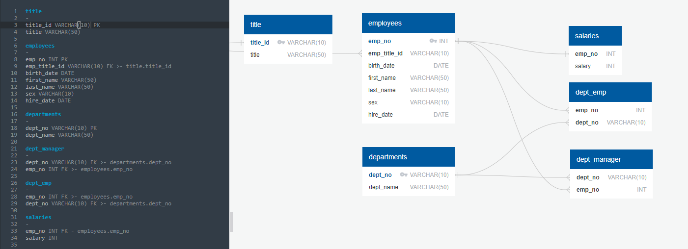

# SQL-Challenge

In this project, we have been presented with a hypothetical research task involving a company's workforce during the 1980s and 1990s. To conduct our analysis, we will utilize an SQL database and import relevant CSV files from the employee database. To begin this process, we will engage in data modeling to establish relationships between these CSV files by specifying data types, primary keys, foreign keys, and any other pertinent constraints. Additionally, we can utilize the [QuickDBD](https://www.quickdatabasediagrams.com/) tool to create an Entity Relationship Diagram to further facilitate this process.

After successfully modeling and engineering our data, we will proceed with the analysis phase, where we will answer eight unique questions provided by our employer. These questions will require the utilization of SQL queries to extract meaningful insights from the data

